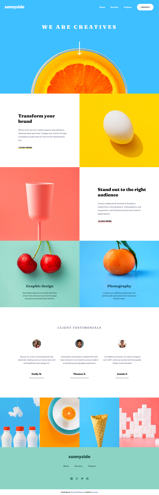
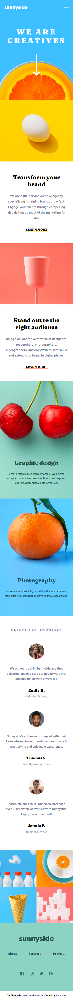

# Frontend Mentor - Sunnyside agency landing page solution

This is a solution to the [Sunnyside agency landing page challenge on Frontend Mentor](https://www.frontendmentor.io/challenges/sunnyside-agency-landing-page-7yVs3B6ef). Frontend Mentor challenges help you improve your coding skills by building realistic projects.

## Table of contents

- [Overview](#overview)
  - [The challenge](#the-challenge)
  - [Screenshot](#screenshot)
  - [Links](#links)
- [My process](#my-process)
  - [Built with](#built-with)
  - [What I learned](#what-i-learned)
  - [Continued development](#continued-development)
  - [Useful resources](#useful-resources)
- [Author](#author)
- [Acknowledgments](#acknowledgments)

## Overview

### The challenge

Users should be able to:

- View the optimal layout for the site depending on their device's screen size
- See hover states for all interactive elements on the page

### Screenshot

     <-- desktop screenshot
      <-- mobile screenshot

### Links

- Solution URL: https://www.frontendmentor.io/solutions/sunnyside-agency-landing-page-using-flexbox-grid-and-js-animations-Nd6yWacDwL
- Live Site URL: https://frussen.github.io/Project1__Sunnyside_FrontendMentor/

## My process

### Built with

- Semantic HTML5 markup
- CSS custom properties
- Flexbox
- CSS Grid
- Mobile-first workflow
- Media queries for responsive design

### What I learned

Whith this project I learned a lot: from the organization of the workflow, to using .scss files, from how to create an animated mobile dropdown menu to how to host a live site with GitHub Pages (one of the last challenge was to use the correct urls for images and files because some of theme where absolute but the root directory of the repository could not access the needed files).

### Continued development

I want for sure to continue working on similar projects as this was the first rendered website I ever did. I hope to learn more about mixins and other responsive alternatives to media queries, putting more attention also to the tablet range that I somewhat overlooked due to it not being requested or present in the design.

### Useful resources

I don't really have useful resources, for sure I should have written them while solving the problems I found in the making of the project but as of right now it would be too difficoult to find them again.
See Acknowledgments for a little bit more.

## Author

- GitHub - https://github.com/Frussen
- Frontend Mentor - https://www.frontendmentor.io/profile/Frussen
- Twitter - https://twitter.com/frussen27

## Acknowledgments

I based the organization of the files and the programming workflow plus got inspirations for some tip and tecniques from the Youtube channel CoderCoder. The "build a website from scratch" playlist was for me really helpful so I would like to thank this youtuber here by adding the url of said playlist:
https://www.youtube.com/watch?v=8w_kHIAkucA&list=PLUWqFDiirlsuYscECzks6zIZWr_Cfcx9k
